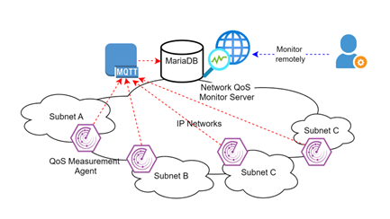
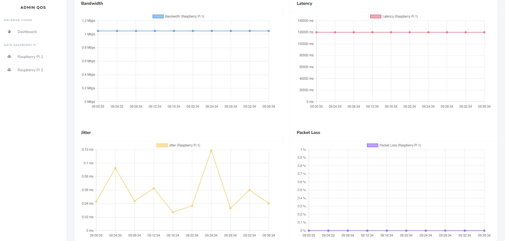

# 🌐 A Network QoS Monitor System on IP Networks

  
  
  

## 🧠 Why I Built This

The increasing reliance on internet services for critical operations highlights the absolute necessity for reliable and high-performing networks. However, network administrators often face structural challenges such as bandwidth limitations, latency, jitter, and packet loss, which significantly impact operational efficiency and user satisfaction.

During my research, I observed that traditional monitoring often lacks the real-time granularity needed to proactively identify issues before they cause service disruptions.
This led to a key objective:

> *How can we implement a robust monitoring system that precisely measures and analyzes key network metrics to ensure optimized reliability in IP networks?* 

---

## 🚀 What I Built

I developed a distributed Quality of Service (QoS) monitoring system that enables institutions to:

* Measure and analyze critical metrics (bandwidth, latency, jitter, and packet loss) in real-time.
* Deploy cost-effective Measurement Agents across various subnets to capture granular data
* Utilize a seamless data pipeline via the MQTT protocol for high-integrity transmission.
* Monitor network health remotely through an interactive, intuitive dashboard
  
This is more than a simple speed test — it is **a real-time network intelligence system for performance optimization.**

---

## 🎯 Project Context

* **Type:** International Student Project (IISMA 2024)
* **Field:** Network Engineering & IoT.
* **Institution:** National Formosa University (NFU), Taiwan
* **Validation:** Developed in the IoT and Intelligent Cloud Application Lab under the guidance of Prof. Hui-Kai Su.
---

## 👨‍💻 My Contribution
* Designed the distributed QoS monitoring architecture
* Developed Raspberry Pi-based measurement agents
* Implemented MQTT-based real-time data pipeline
* Built backend data processing using Python and MariaDB
* Designed dashboard for real-time and historical visualization

---

## 🌍 System Scale
* Deployed across multiple subnets (A, B, C, D)
* Multiple Raspberry Pi agents collecting data simultaneously
* Real-time data streaming via MQTT protocol
* Continuous monitoring in a real-world lab environment

---

## ⚙️ My Approach (How I Think)

Instead of a centralized, expensive monitoring solution, I focused on three engineering principles:

### 1. Distributed Scalability
Standard monitoring often misses issues occurring in specific network branches.

➡️ I utilized Raspberry Pi 4 devices as agents deployed across Subnets A, B, C, and D to collect precise local data.

### 2. Integration of Hardware & Software
Accurate insights require a seamless bridge between the physical and digital layers.

➡️ I integrated Raspberry Pi 4 hardware with software tools like iPerf3 and MariaDB for structured data management.

### 3. Actionable Visualization
Raw data is complex and often difficult for administrators to interpret quickly.

➡️ I focused on transforming complex metrics into intuitive visual formats, enabling faster decision-making and quicker issue resolution.

---

## 🏗️ System Architecture

  

  <em>
The system architecture consists of distributed QoS measurement agents deployed across multiple subnets (A–D) that collect network performance metrics and transmit them via MQTT to a centralized monitoring server integrated with a MariaDB database for storage and analysis. Administrators can remotely access real-time and historical network insights through a web-based dashboard, enabling efficient monitoring and troubleshooting of network performance.
  </em>

---

## 🚀 Key Features
* **📍Real-Time Tracking:** Precise measurement of bandwidth, latency, jitter, and packet loss using iPerf3.
* **📡 MQTT Communication:** Data transmission via MQTT Broker for real-time distribution and message queuing.
* **📊 Centralized Monitor Server:** A dedicated server that subscribes to topics, validates incoming data, and manages storage.
* **💾 Historical Analysis:** Validated data is stored in MariaDB to facilitate long-term performance auditing.
* **🖥️ Interactive Dashboard:** A real-time web interface providing graphical representations of current and historical network performance.
---

## 🧠 Comprehensive Reasoning (The "Why")

### **The Problem: Network Disruptions**
Critical network challenges like bandwidth caps and high latency lead to poor performance and user dissatisfaction.
* **Operational Gap:** Without real-time visibility, administrators cannot proactively resolve issues, leading to reactive maintenance.
  
### **The Solution: Why Agents & MQTT?**
1. **Precision Logic:** Precision Logic: Distributed agents allow for accurate data collection across a diverse network configuration.
2. **Data Integrity:** The MQTT protocol maintains consistency and integrity during real-time dataReception.
3. **Automated Ecosystem:** Integration of hardware and software replaces manual monitoring workloads with a cohesive, automated system.

---

## Real-World Impact
- **Network Reliability**: Administrators can proactively identify and resolve network issues, significantly enhancing user satisfaction.
- **Efficiency**: Transforming complex network data into actionable insights through clear visualization.

---

## 📚 Academic Achievement
The methodology and results of this project were peer-reviewed and documented:
- Title: "A Network QoS Monitor System on IP Networks"
- Award: IISMA 2024 Project Completion at National Formosa University

---

## 🛠️ Tech Stack
| Category | Tools & Technologies |
| :--- | :--- |
| **Hardware** | Raspberry Pi 4 Model B, TP-Link AC1750 |
| **Backend** | Python, MariaDB (MySQL), MQTT (Mosquitto) |
| **Network Tools**| iPerf3 (Traffic Analysis), MQTT Protocol |
| **Visualization**|  Real-Time Dashboard with Graphical Representation |

---

## 🔄 Full System Workflow

### 1. System Architecture
1. **Agent Initialization:** Agen Raspberry Pi menyiapkan konfigurasi *hardware* dan *software*.
2. **Measurement:** Agents measure QoS parameters using iPerf3.
3. **Transmission:** Validated and formatted data is published to the **MQTT Broker**.
4. **Processing:** The **QoS Monitor Server** subscribes to relevant topics, validates the data, and stores it in **MariaDB**.
5. **Visualization:** The **Real-Time Dashboard** processes the database records to update intuitive graphs and tables.
   
---

## 🌐 Live System Access
You can explore the live monitoring dashboard directly through the link below:
### Link: https://hksu.ee.nfu.edu.tw/netqos/webqos/dashboard/index.php
**Username**: 
doli

**Password**: 
doli

---

## 📺 Visuals & Simulation

### 💻 Dashboard Interface
*The dashboard provides clear insights into network performance across multiple Raspberry Pi agents.*

  
  
  
  

  <em>
  From left to right: real-time QoS trend visualization from Raspberry Pi 1 and Raspberry Pi 2, followed by raw QoS data records collected from each agent, enabling comparative analysis across multiple network nodes.
  </em>

### 🎥 Video Demonstration
*Click the thumbnail below to watch the system in action.*

#### **Real-Time QoS Monitoring Simulation**

> **Simulation Focus:**  
> Demonstrates real-time QoS data collection from distributed Raspberry Pi agents, including bandwidth, latency, jitter, and packet loss, along with data transmission via MQTT and visualization on the monitoring dashboard.

---

## 📈 Learning Journey

### **⚠️ Challenges & Overcoming Them**
1. **Data Inconsistencies**
   * **Challenge:** During reception, some data packets might be inconsistent or contain errors.
   * **Overcoming:** I implemented a Data Validation phase at the server level, logging invalid data for debugging to ensure only accurate metrics are stored and visualized.
     
### **What I Learned**
Working at the IoT and Intelligent Cloud Application Lab in Taiwan sharpened my skills in Data Integration and Advanced Problem-Solving. I learned to master the integration of hardware like Raspberry Pi 4 with robust software tools, developing a comprehensive understanding of real-time system synchronization. Beyond technical skills, working in a multidisciplinary environment developed my Collaborative Development capabilities, ensuring diverse components integrate into one cohesive system.

---

